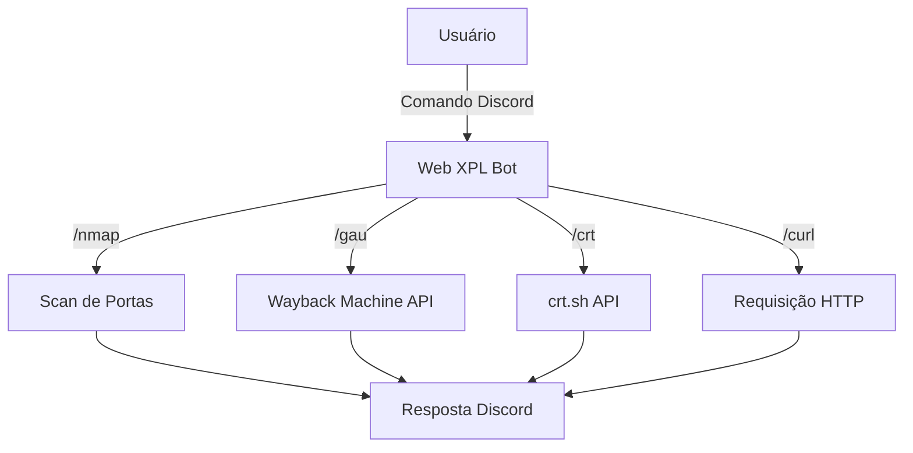

# 🔍 Web XPL Bot

<div align="center">


**Um bot Discord especializado em reconhecimento web para pentests**

*Simulação de endpoints e comandos úteis para reconhecimento ativo e passivo*

</div>

---

## 📋 Sobre o Projeto

O **Web XPL Bot** é uma ferramenta educacional desenvolvida para Discord que simula comandos comuns utilizados em pentests web. O bot oferece funcionalidades de reconhecimento tanto ativo quanto passivo, permitindo escaneamento de portas, coleta de URLs arquivadas e consulta de certificados SSL.

## 🚀 Funcionalidades

### 🎯 Comandos Implementados

| Comando | Descrição | Tipo |
|---------|-----------|------|
| `/nmap <host>` | Escaneamento de portas e serviços | Reconhecimento Ativo |
| `/gau <domínio>` | Coleta de URLs passivas via Wayback Machine | Reconhecimento Passivo |
| `/crt <domínio>` | Consulta certificados SSL e subdomínios | Reconhecimento Passivo |
| `/curl <url>` | Execução de requisições HTTP | Teste de Conectividade |

---

## 📖 Guia de Comandos

### 🔍 `/nmap <host>`
Executa um scan básico de portas e serviços no host especificado.
- **Faixa de portas**: 22-443
- **Retorna**: Lista de portas abertas e serviços identificados

```bash
/nmap example.com
```

### 📚 `/gau <domínio>`
Utiliza a API da Wayback Machine para buscar URLs arquivadas.
- **Fonte**: Internet Archive
- **Retorna**: Lista de URLs históricas do domínio

```bash
/gau example.com
```

### 🔐 `/crt <domínio>`
Consulta a base de dados crt.sh para certificados SSL.
- **Funcionalidade**: Descoberta de subdomínios
- **Retorna**: Certificados e domínios relacionados

```bash
/crt example.com
```

### 🌐 `/curl <url>`
Executa requisições HTTP e retorna a resposta.
- **Método**: GET request
- **Retorna**: Conteúdo da resposta HTTP

```bash
/curl http://example.com
```

---

## ⚙️ Instalação e Configuração

### 📋 Pré-requisitos

- 
- Bot Discord Token
- Ambiente de desenvolvimento

### 🔧 Dependências

```bash
# Bibliotecas necessárias
discord.py      # Interação com Discord API
requests        # Requisições HTTP
python-dotenv   # Gerenciamento de variáveis de ambiente
```

### 📥 Passo a passo

1. **Clone o repositório**
   ```bash
   git clone https://github.com/mathvillao/web-xpl-bot.git
   cd web-xpl-bot
   ```

2. **Crie e ative o ambiente virtual**
   ```bash
   # Criar ambiente virtual
   python -m venv bot-env
   
   # Ativar no Windows
   .\bot-env\Scripts\activate
   
   # Ativar no Linux/Mac
   source bot-env/bin/activate
   ```

3. **Instale as dependências**
   ```bash
   pip install discord.py requests python-dotenv
   ```

4. **Configure as variáveis de ambiente**
   
   Crie um arquivo `.env` na raiz do projeto:
   ```env
   DISCORD_TOKEN=seu_token_do_discord_aqui
   ```

5. **Execute o bot**
   ```bash
   python bot.py
   ```

---

## 🏗️ Arquitetura do Sistema

### 🔧 Tecnologias Utilizadas

- **Discord.py**: Framework para desenvolvimento de bots Discord
- **Requests**: Biblioteca para requisições HTTP
- **Wayback Machine API**: Fonte de dados para URLs arquivadas
- **crt.sh API**: Base de dados de certificados SSL

### 📊 Fluxo de Funcionamento



---

## 💡 Exemplos de Uso

### 🎯 Cenário: Reconhecimento de Domínio

```bash
# 1. Verificar portas abertas
/nmap target.com

# 2. Coletar URLs históricas
/gau target.com

# 3. Descobrir subdomínios via certificados
/crt target.com

# 4. Testar conectividade
/curl https://target.com
```

### 📈 Saída Esperada

```
🔍 Scan Results for target.com:
✅ Port 22: SSH
✅ Port 80: HTTP
✅ Port 443: HTTPS

📚 Archived URLs found: 150
🔐 Certificates found: 5 subdomains
🌐 HTTP Status: 200 OK
```

---

## 📚 Recursos Adicionais

### 🔗 Links Úteis

- [Discord.py Documentation](https://discordpy.readthedocs.io/)
- [Wayback Machine API](https://archive.org/help/wayback_api.php)
- [crt.sh Certificate Search](https://crt.sh/)

### 🎓 Aprendizado

Este projeto demonstra:
- Integração com APIs externas
- Desenvolvimento de bots Discord
- Conceitos básicos de pentest web
- Automação de tarefas de reconhecimento

---