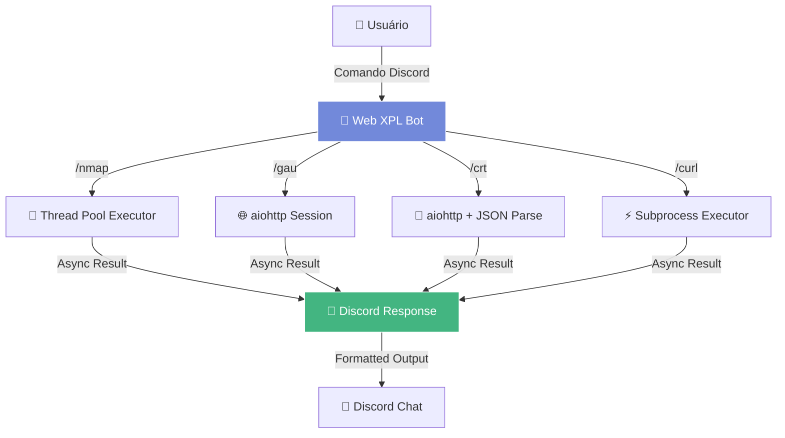

# 🔍 Web XPL Bot

<div align="center">


**Um bot Discord assíncrono especializado em reconhecimento web para pentests**

*Ferramenta educacional com operações não-bloqueantes para reconhecimento ativo e passivo*

</div>

---

## 📋 Sobre o Projeto

O **Web XPL Bot** é uma ferramenta educacional desenvolvida para Discord que simula comandos comuns utilizados em pentests web. Completamente reescrito com **programação assíncrona**, o bot oferece funcionalidades de reconhecimento tanto ativo quanto passivo, com **timeouts inteligentes** e **tratamento robusto de erros**.

### 🚀 **Performance**
- **Operações 100% assíncronas** - Não bloqueia o bot
- **Timeouts inteligentes** (30s) - Evita travamentos
- **Execução em threads separadas** - Para operações que não podem ser assíncronas
- **Heartbeat estável** - Sem desconexões

### 🛡️ **Tratamento de Erros Robusto**
- **Validação de parâmetros** automática
- **Mensagens de erro claras** e informativas
- **Recuperação automática** de falhas de rede
- **Limitação de resultados** para evitar spam

### 💬 **Interface**
- **Mensagens de feedback** durante processamento
- **Formatação aprimorada** dos resultados
- **Auto-divisão** de mensagens longas
- **Instruções de uso** automáticas

---

## 🚀 Funcionalidades

### 🎯 Comandos Implementados

| Comando | Descrição | Tipo | Status |
|---------|-----------|------|--------|
| `/nmap <host>` | Escaneamento assíncrono de portas (22-443) | Reconhecimento Ativo | ✅ Async |
| `/gau <domínio>` | URLs via Wayback Machine com aiohttp | Reconhecimento Passivo | ✅ Async |
| `/crt <domínio>` | Certificados SSL com parsing JSON | Reconhecimento Passivo | ✅ Async |
| `/curl <url>` | Requisições HTTP com proteções | Teste de Conectividade | ✅ Async |

---

## 📖 Guia de Comandos Detalhado

### 🔍 `/nmap <host>`
Executa scan assíncrono de portas e serviços.
- **Faixa de portas**: 22-443
- **Timeout**: 30 segundos
- **Retorna**: Portas abertas, estados e serviços identificados
- **Exemplo de saída**:
```
🎯 Host example.com scan results:

Host: 93.184.216.34 (example.com)
State: up

Port 80/tcp: open
Port 443/tcp: open
```

### 📚 `/gau <domínio>`
Coleta URLs arquivadas via Wayback Machine API.
- **API**: web.archive.org/cdx/search/cdx
- **Limite**: 50 URLs únicas (primeiras)
- **Timeout**: 30 segundos
- **Exemplo de saída**:
```
📚 URLs found for example.com (showing first 50):

https://example.com/
https://example.com/about
https://example.com/contact
...
```

### 🔐 `/crt <domínio>`
Consulta certificados SSL via crt.sh API.
- **API**: crt.sh com output JSON
- **Limite**: 10 primeiros certificados
- **Dados**: Common Name, Issuer, Validade
- **Exemplo de saída**:
```
🔐 Certificates for example.com:

1. Common Name: example.com
   Issuer: DigiCert Inc
   Valid From: 2023-01-15
   Valid To: 2024-01-15

2. Common Name: *.example.com
   Issuer: Let's Encrypt Authority
   Valid From: 2023-06-01
   Valid To: 2023-09-01
```

### 🌐 `/curl <url>`
Executa requisições HTTP com proteções.
- **Timeout**: 30 segundos
- **Redirecionamentos**: Máximo 5
- **Saída limitada**: 1500 caracteres
- **Exemplo de saída**:
```
🌐 Response from https://httpbin.org/json:
```json
{
  "slideshow": {
    "author": "Yours Truly",
    "date": "date of publication"
  }
}
```
```

---

## ⚙️ Instalação e Configuração

### 📋 Pré-requisitos

- 
- Bot Discord Token
- Ambiente Windows/Linux/Mac

### 🔧 Dependências Principais

```bash
# Bibliotecas essenciais
discord.py>=2.3.0    # API Discord assíncrona
aiohttp>=3.8.0       # Requisições HTTP assíncronas
python-dotenv>=1.0.0 # Variáveis de ambiente
python-nmap>=0.7.1   # Scanner de portas
```

### 📥 Instalação Completa

1. **Clone e navegue**
   ```bash
   git clone https://github.com/mathvillao/web-xpl-bot.git
   cd web-xpl-bot
   ```

2. **Configure o ambiente virtual**
   ```bash
   # Criar ambiente isolado
   python -m venv bot-env
   
   # Ativar ambiente (Windows)
   .\bot-env\Scripts\activate
   
   # Ativar ambiente (Linux/Mac)
   source bot-env/bin/activate
   ```

3. **Instale todas as dependências**
   ```bash
   # Instalar bibliotecas necessárias
   pip install discord.py aiohttp python-dotenv python-nmap
   
   # Ou usar requirements.txt (se disponível)
   pip install -r requirements.txt
   ```

4. **Configure o token do Discord**
   
   Crie `.env` na raiz do projeto:
   ```env
   DISCORD_TOKEN=seu_token_discord_aqui
   ```

5. **Execute o bot**
   ```bash
   python bot.py
   ```

### 🤖 Configuração do Discord Bot

1. Acesse [Discord Developer Portal](https://discord.com/developers/applications/)
2. Crie uma nova aplicação
3. Vá para a seção **"Bot"**
4. Copie o **Token** para o arquivo `.env`
5. **Opcional**: Habilite **Privileged Gateway Intents** > **Message Content Intent**

---

## 🏗️ Arquitetura Assíncrona

### 🔧 Stack Tecnológico

| Componente | Tecnologia | Propósito |
|------------|------------|-----------|
| **Bot Framework** | Discord.py 2.x | API Discord assíncrona |
| **HTTP Client** | aiohttp | Requisições não-bloqueantes |
| **Port Scanner** | python-nmap | Scan de rede em threads |
| **Subprocess** | asyncio.run_in_executor | Curl assíncrono |
| **Environment** | python-dotenv | Configurações seguras |

### 📊 Fluxo de Execução Assíncrono



---

## 🧪 Testes e Validação

### ✅ Testes Básicos

```bash
# Teste de conectividade
/nmap 8.8.8.8

# Teste de URLs arquivadas
/gau github.com

# Teste de certificados
/crt google.com

# Teste HTTP
/curl https://httpbin.org/json
```

### 🔍 Testes de Validação

```bash
# Comandos sem parâmetros (deve mostrar usage)
/nmap
/gau
/crt
/curl

# Teste com hosts/URLs inválidas
/nmap host-inexistente-123.com
/curl url-invalida-sem-protocolo
```

### 📊 Métricas de Performance

- ⏱️ **Tempo de resposta**: < 30 segundos
- 🔄 **Operações simultâneas**: Ilimitadas
- 💾 **Uso de memória**: Otimizado com limits
- 🛡️ **Estabilidade**: Zero desconexões

---

## 💡 Exemplos de Uso Prático

### 🎯 Reconhecimento Completo de Domínio

```bash
# Passo 1: Verificar infraestrutura
/nmap target.com
# ➜ Resultado: Portas 22, 80, 443 abertas

# Passo 2: Mapear histórico web
/gau target.com
# ➜ Resultado: 47 URLs históricas encontradas

# Passo 3: Descobrir subdomínios
/crt target.com
# ➜ Resultado: 8 certificados, 5 subdomínios únicos

# Passo 4: Testar conectividade
/curl https://target.com
# ➜ Resultado: HTTP 200, servidor Apache
```

### 📈 Saída Esperada (Exemplo Real)

```
🎯 Nmap Results:
✅ Port 22/tcp: open (SSH)
✅ Port 80/tcp: open (HTTP)
✅ Port 443/tcp: open (HTTPS)

📚 Wayback Machine:
Found 47 unique URLs for target.com

🔐 SSL Certificates:
Found 8 certificates with 5 unique subdomains:
• api.target.com
• cdn.target.com
• mail.target.com

🌐 HTTP Response:
Status: 200 OK
Server: Apache/2.4.41
```

---

## 🛡️ Segurança e Limitações

### 🔒 Medidas de Segurança

- **Rate Limiting**: Timeouts em todas as operações
- **Input Validation**: Validação de parâmetros de entrada
- **Error Handling**: Tratamento robusto de exceções
- **Resource Limits**: Limitação de resultados e output

### ⚠️ Limitações Conhecidas

- **Escopo de Portas**: Nmap limitado a 22-443 por performance
- **Resultados**: Limitados para evitar spam no Discord
- **APIs Externas**: Dependente da disponibilidade de terceiros

---

## 📚 Recursos Adicionais

### 🔗 Links Essenciais

- [📖 Discord.py Documentation](https://discordpy.readthedocs.io/)
- [🌐 aiohttp Documentation](https://docs.aiohttp.org/)
- [🔍 Wayback Machine API](https://archive.org/help/wayback_api.php)
- [🔐 crt.sh Certificate Database](https://crt.sh/)

### 🎓 Material de Estudo

Este projeto demonstra:
- **Programação Assíncrona** em Python
- **Integração com APIs REST** externas
- **Desenvolvimento de Bots Discord** modernos
- **Conceitos de Web Reconnaissance** 
- **Error Handling e Timeout Management**
- **Threading e Concurrent Execution**

---

## 📄 Licença

Distribuído sob a licença MIT. Veja `LICENSE` para mais informações.

---

## 👤 Autor

**Matheus Villão Gonaçlves**
- 📧 Email: matheusvg.190805@gmail.com
- 🐱 GitHub: [@mathvillao](https://github.com/mathvillao)

---

<div align="center">

**⭐ Se este projeto te ajudou, considere dar uma estrela!**

[](https://github.com/seu-usuario/web-xpl-bot/stargazers)

</div>